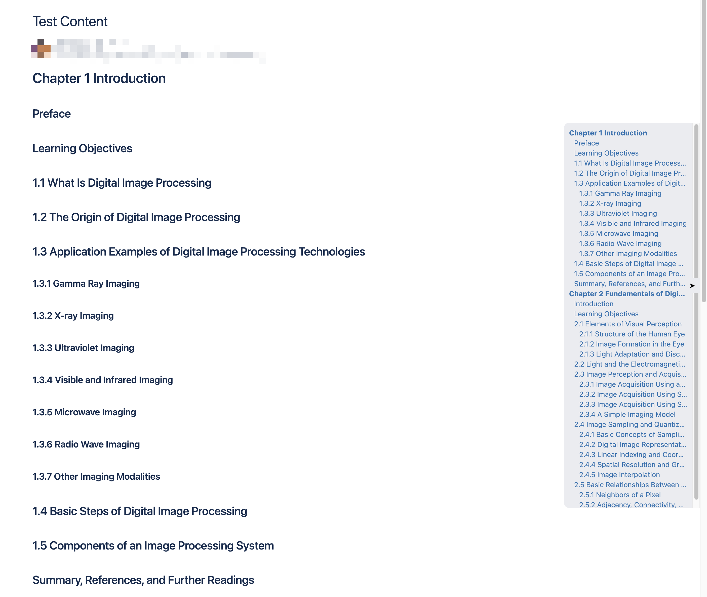

This repository has been deprecated, and I used a template to refactor the code of this repository. Please visit this address: [ConfluenceSideBar](https://github.com/VeejaLiu/ConfluenceSideBar)

# Confluence Side Navbar 

This Chrome extension is designed to enhance your experience while using Confluence by adding a side navbar. The side navbar will help you quickly locate content, making it easier and faster to access the information you need.

## Demo

## Installation

1. Download the zip file from the [latest release](https://github.com/VeejaLiu/ConfluenceSideNavbar/releases/latest).
2. Unzip the file.
3. Open Chrome and go to `chrome://extensions/`.
   - You can also access this page by clicking the Chrome menu on the top right corner, then select `More tools` -> `Extensions`.
4. Turn on `Developer mode` on the top right corner.
5. Click `Load unpacked` on the top left corner.
6. Select the unzipped folder.
7. You should see the extension is added to the list.
8. Go to your Confluence page and you should see the side navbar.
